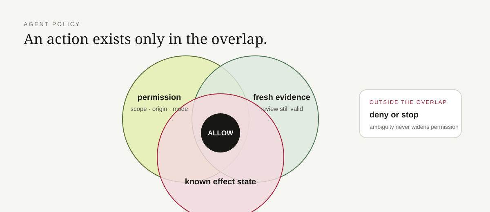

# Agent Policy Core

A deny-by-default policy gate for tool-calling agents. It keeps **authorization** separate from **effect-state/idempotency**, so a request can be permitted and still be blocked from replay.



## Verify it

Requires Node.js 20+ and has no runtime dependencies.

```bash
npm test
npm run demo
for file in src/*.js; do node --check "$file"; done
```

CircleCI runs the same behavior tests, walkthrough, source syntax checks, and proof-file checks.

## Control flow

### 1. Authorization

`src/policy.js` evaluates the requested platform, action, target, execution mode, evidence freshness, and any provenance requirement against the reviewed registry in `src/registry.js`.

The gate can **narrow** authority; it cannot widen it. Examples implemented here:

- unknown platform/action → deny;
- origin/path mismatch or credential-bearing URL → deny;
- execution mode outside the reviewed grant → deny with a safer effective mode where available;
- stale evidence → deny higher-autonomy execution and narrow to a safer mode;
- missing required human provenance → deny;
- requested write caps → clamp to local limits.

Policy decisions return explicit reason strings such as `unsupported_action`, `mode_not_allowed`, `policy_evidence_stale`, and `provenance_blocked`.

### 2. Effect state / idempotency

Authorization does not answer whether an external write is safe to repeat. `src/dedupe.js` and `src/journal.js` handle that separately.

For the same effect key:

| Latest effect state | Result |
|---|---|
| none | eligible to proceed |
| `effect_intent` | block as `duplicate_intent` |
| `effect_confirmed` | block as `duplicate_effect` |
| `effect_ambiguous` | block as `ambiguous_side_effect` |

An ambiguous result means **stop and verify**, not retry. The blocking result includes the prior record where implemented, and the append-only journal redacts sensitive fields before persistence.

> Uncertainty is not permission to click twice.

## Code to inspect first

| File | Responsibility |
|---|---|
| [`src/registry.js`](src/registry.js) | reviewed grants, modes, limits, and evidence |
| [`src/policy.js`](src/policy.js) | pure authorization decision and narrowing |
| [`src/dedupe.js`](src/dedupe.js) | duplicate, cross-target, and ambiguous-effect blocking |
| [`src/journal.js`](src/journal.js) | append-only effect evidence with redaction |
| [`test/policy.test.js`](test/policy.test.js) | authorization boundary tests |
| [`test/dedupe.test.js`](test/dedupe.test.js) | effect-state/idempotency tests |
| [`examples/walkthrough.js`](examples/walkthrough.js) | runnable decision walkthrough |

## Scope and claim boundary

This is a policy proof, not a sandbox or browser driver. It has no network client, browser integration, credential store, or provider SDK. The caller must invoke the gate before external tools and persist/use the journal appropriately.

See [SECURITY.md](SECURITY.md) for assumptions, [PROVENANCE.md](PROVENANCE.md) for what was preserved from the private Browser Bridge work, and [docs/invariants.md](docs/invariants.md) / [docs/failure-modes.md](docs/failure-modes.md) for the failure contract.
