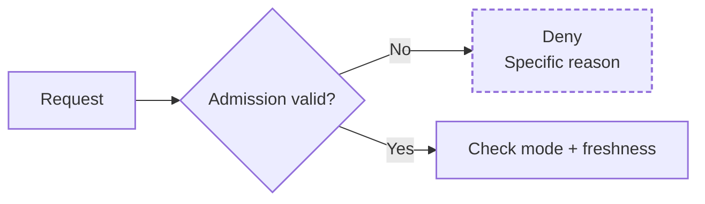
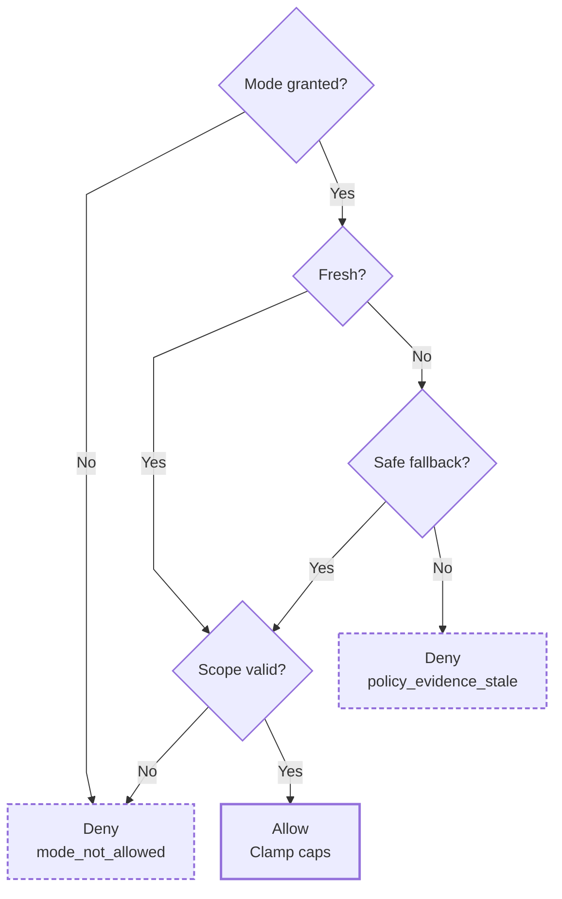
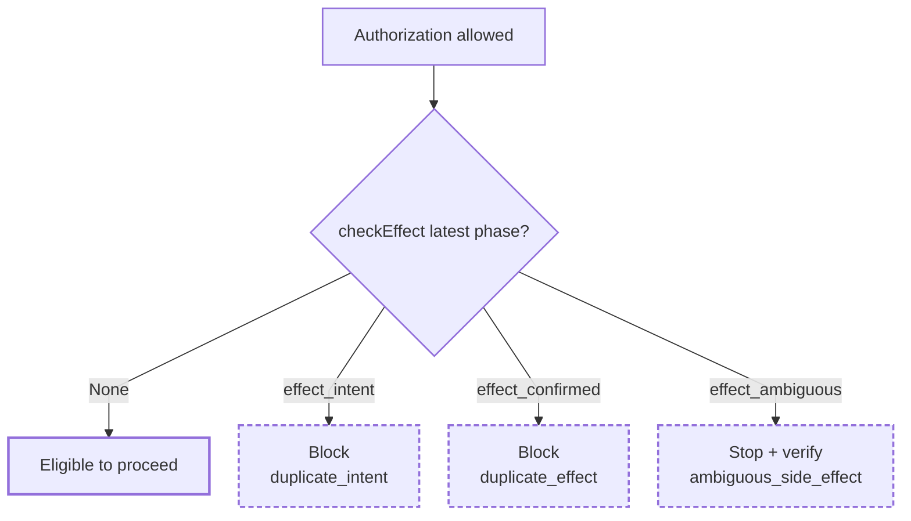

# Agent Policy Core

A deny-by-default policy gate for tool-calling agents. It keeps **authorization** separate from **effect-state/idempotency**, so a request can be permitted and still be blocked from replay.

**Sometimes the correct tool call is no tool call.**

This public sample extracts policy and effect-state patterns from my private browser-control work. I can integrate and adapt these gates within broader agent applications and automation workflows; the code here makes the decisions inspectable without exposing the surrounding private systems.

## Authorization narrows; never widens

`src/policy.js` checks admission in this exact order:

1. **Reviewed registry:** supported platform, then allowed action; failures return `unsupported_platform` or `unsupported_action`.
2. **Exact target:** parse the URL, require the claimed origin to match, reject embedded credentials, and require HTTPS except the explicit HTTP loopback fixture. Enforce origin ownership and the platform's reviewed origin/path rules; failures return `redirect_outside_allowlist`.
3. **Required provenance:** news-aggregator comments require a nonempty provenance object whose values are all `human_authored_unedited`; failure returns `provenance_blocked`.

## Mode and freshness can narrow permission

The mode check runs before freshness, so an ungranted mode cannot be mistaken for stale evidence. Safe fallback modes are `attended_prepare` and `manual_only`.

Both denials return a safer `effectiveMode`. After freshness, the final scope check still refuses `generic_form` browser mode without a reviewed per-origin browser grant (`mode_not_allowed`). Requests that pass have their requested write caps clamped to registry limits. Missing, invalid, or future-dated review evidence is stale; a generic form without a reviewed domain entry is also stale.

## Effect state is a separate decision

`src/dedupe.js` treats intent, confirmed effects, and ambiguous effects as hard stops. `createPolicyHook()` can also block confirmed or ambiguous reuse of the same content across different targets inside the configured dedupe window.

## Code to inspect first

| File | Responsibility |
|---|---|
| [`src/registry.js`](src/registry.js) | reviewed grants, modes, limits, and evidence |
| [`src/policy.js`](src/policy.js) | pure authorization decision and narrowing |
| [`src/dedupe.js`](src/dedupe.js) | duplicate, cross-target, and ambiguous-effect blocking |
| [`src/journal.js`](src/journal.js) | append-only effect evidence with redaction |
| [`test/policy.test.js`](test/policy.test.js) | authorization boundary tests |
| [`test/dedupe.test.js`](test/dedupe.test.js) | effect-state/idempotency tests |
| [`examples/walkthrough.js`](examples/walkthrough.js) | decision walkthrough |

## Evidence and boundaries

CircleCI is configured to check source syntax, behavior tests, the walkthrough, and required public docs. Exact local commands and expected checks: [docs/verification.md](docs/verification.md).

This is a policy library, not a sandbox or browser driver. It has no network client, browser integration, credential store, or provider SDK. The caller must invoke the gate before external tools and persist/use the journal appropriately.

See [SECURITY.md](SECURITY.md), [PROVENANCE.md](PROVENANCE.md), [docs/invariants.md](docs/invariants.md), and [docs/failure-modes.md](docs/failure-modes.md) for the assumptions and failure contract.
